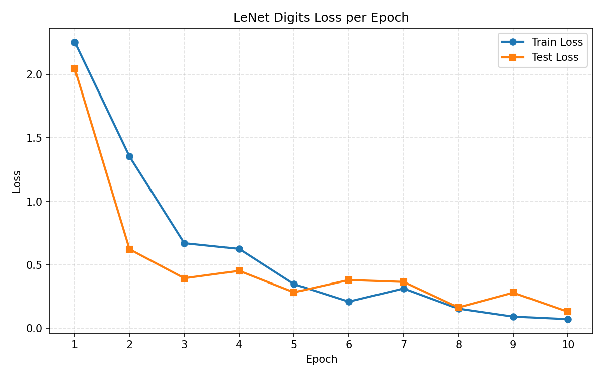
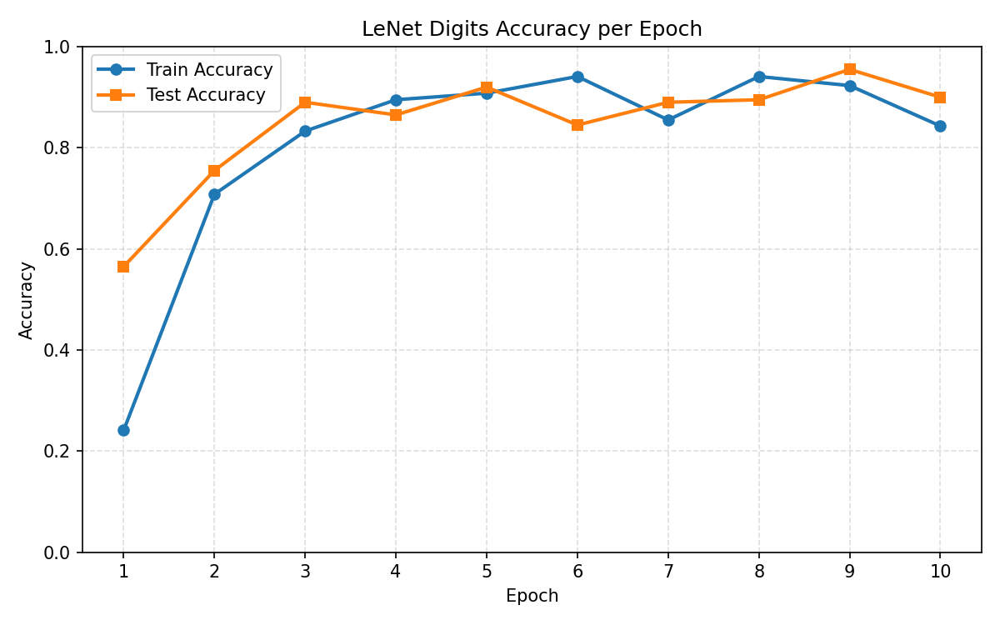
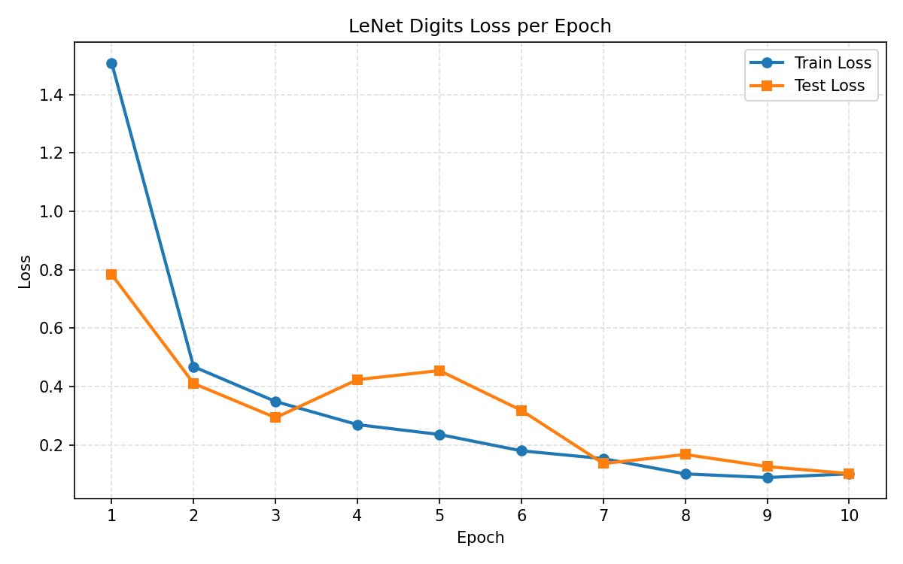
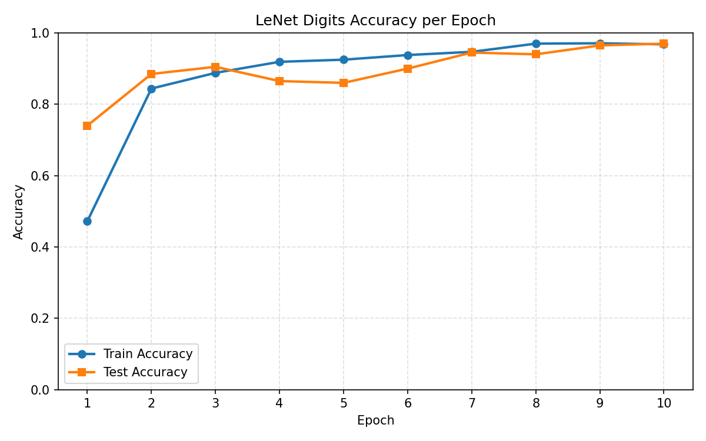

# NanoTorch: Deep Learning from First Principles

**Ever wondered what actually happens when you call `.backward()` in PyTorch?**

NanoTorch is an educational, from-scratch implementation of a modern deep learning framework in pure Python. While production frameworks like PyTorch and TensorFlow are optimized for performance, they often hide the elegant mathematical machinery behind layers of C++ and CUDA code. 

NanoTorch pulls back the curtain. By stripping away the complexity and focusing on the core logic, this project provides a transparent "glass box" view into:
- **Autograd Engine:** Building a dynamic computational graph and implementing backpropagation manually.
- **Tensor Foundations:** Understanding how multidimensional arrays and broadcast operations form the bedrock of AI.
- **Architectural Anatomy:** Constructing everything from basic Linear layers to complex Multi-Head Attention mechanisms from the ground up.
- **Optimization Intuition:** Implementing algorithms like Adam and SGD to see exactly how they steer weights through the loss landscape.

Whether you're a student trying to bridge the gap between theory and code, or an engineer looking to deepen your architectural understanding, NanoTorch is built to be read, tinkered with, and understood.

## Mission
This repository intends to showcase the implementation of PyTorch, one of the most popular ML libraries, from scratch in pure Python.

## Table of Contents

| Module | Description |
| :--- | :--- |
| [Tensor](./Tensor) | Core multidimensional array structure with basic operations. |
| [activations](./activations) | Common activation functions (ReLU, Sigmoid, Softmax, Tanh, GELU). |
| [layers](./layers) | Fundamental building blocks for neural networks (Linear, Dropout, etc.). |
| [losses](./losses) | Standard loss functions for optimization. |
| [dataloader](./dataloader) | Utilities for batching, shuffling, and processing datasets. |
| [autograd](./autograd) | Automatic differentiation engine for gradient computation. |
| [optimizers](./optimizers) | Optimization algorithms (SGD, Adam, etc.) to update parameters. |
| [training](./training) | Scripts and utilities for managing the training lifecycle. |
| [convolution](./convolution) | Implementation of convolutional layers and pooling operations. |
| [tokenization](./tokenization) | Text processing and tokenization tools for NLP. |
| [embeddings](./embeddings) | Vector representation for discrete tokens and positional encoding. |
| [attention](./attention) | Scaled Dot-Product and Multi-Head Attention mechanisms. |
| [transformers](./transformers) | Transformer architecture implementation. |
| [optimization](./optimization) | Specialized optimization techniques and performance analyses. |
| [nanotorch](./nanotorch) | Core library integration. |
| [experiments](./experiments) | Pipeline tests and architectural experiments. |
| [projects](./projects) | End-to-end applications and project examples. |

## Disclaimer
The implementation is still ongoing, so the code in this repo is not fully complete.

## Benchmarks
This benchmark guide documents representative training behavior for the educational models in NanoTorch. The goal is not to present production-grade leaderboard numbers, but to communicate how the framework behaves during optimization, how quickly models converge, and how training and evaluation metrics evolve across epochs.

For the current CNN benchmark, `projects/CNNS/lenet_digits.py` trains a LeNet-style classifier on the local NanoDigits dataset for 10 epochs and writes two benchmark artifacts:
- `projects/CNNS/plots/lenet_digits_loss.png`
- `projects/CNNS/plots/lenet_digits_accuracy.png`

These plots track four core statistics after every epoch: training loss, test loss, training accuracy, and test accuracy. They are intended to help readers judge convergence quality, generalization behavior, and the stability of the underlying training implementation.

### LeNetDigits Benchmark Summary

| Benchmark | Dataset | Epochs | Metrics Tracked | Observed Result |
| :--- | :--- | :---: | :--- | :--- |
| LeNetDigits | NanoDigits | 10 | Train loss, test loss, train accuracy, test accuracy | Loss curves decrease over training, while accuracy curves increase and then stabilize toward the later epochs. |

### LeNetDigits Benchmark Interpretation

| Signal | What the plots show | Why it matters |
| :--- | :--- | :--- |
| Training loss | Falls steadily across epochs | The optimizer is successfully fitting the training split. |
| Test loss | Declines alongside training loss | The model is improving on held-out data rather than only memorizing the train set. |
| Training accuracy | Rises quickly in early epochs and then tapers | The network learns useful digit features early and approaches convergence later in training. |
| Test accuracy | Tracks the training trend with a small gap | Generalization remains reasonably aligned with training performance. |

### Benchmark Artifacts

| Plot | Purpose |
| :--- | :--- |
| `lenet_digits_loss.png` | Visualizes how train loss and test loss change after each epoch. |
| `lenet_digits_accuracy.png` | Visualizes how train accuracy and test accuracy change after each epoch. |

### MiniResNetDigits Benchmark Summary

`projects/CNNS/mini_resnet_digits.py` trains a small residual CNN on NanoDigits for 10 epochs using the repository's `TensorDataset` and `Dataloader`. Like the other CNN benchmarks, it writes loss and accuracy curves after every epoch, and the script now also saves CSV and JSON benchmark outputs for future runs.

| Benchmark | Dataset | Epochs | Metrics Tracked | Artifacts |
| :--- | :--- | :---: | :--- | :--- |
| MiniResNetDigits | NanoDigits | 10 | Train loss, test loss, train accuracy, test accuracy | `mini_resnet_digits_loss.png`, `mini_resnet_digits_accuracy.png` |

### MiniResNetDigits Measured Results

The current repository already contains `mini_resnet_digits_loss.png` and `mini_resnet_digits_accuracy.png`, but this run was generated before CSV and JSON exports were added to the script. The values below are therefore inferred from the saved plots and should be treated as approximate.

| Statistic | Approximate Value |
| :--- | :--- |
| Train size | 1000 images |
| Test size | 200 images |
| Batch size | 32 |
| Epochs | 10 |
| Final train loss | ~0.10 |
| Final test loss | ~0.10 |
| Final train accuracy | ~97.0% |
| Final test accuracy | ~97.0% |
| Best train accuracy | ~97.0% at epochs 8-10 |
| Best test accuracy | ~97.0% at epochs 9-10 |
| Lowest train loss | ~0.09 at epoch 9 |
| Lowest test loss | ~0.10 at epochs 7 and 10 |

### MiniResNetDigits Epoch Trend

The saved plots suggest the following approximate training trajectory.

| Epoch | Train Loss | Test Loss | Train Acc | Test Acc |
| :---: | :---: | :---: | :---: | :---: |
| 1 | ~1.51 | ~0.79 | ~47.0% | ~74.0% |
| 2 | ~0.47 | ~0.41 | ~84.5% | ~88.5% |
| 3 | ~0.35 | ~0.30 | ~88.5% | ~90.5% |
| 4 | ~0.27 | ~0.42 | ~92.0% | ~86.5% |
| 5 | ~0.24 | ~0.45 | ~92.5% | ~86.0% |
| 6 | ~0.18 | ~0.32 | ~93.5% | ~90.0% |
| 7 | ~0.16 | ~0.14 | ~94.5% | ~94.5% |
| 8 | ~0.10 | ~0.17 | ~97.0% | ~94.0% |
| 9 | ~0.09 | ~0.13 | ~97.0% | ~96.5% |
| 10 | ~0.10 | ~0.10 | ~97.0% | ~97.0% |

### MiniResNetDigits Statistics Guide

| Statistic | Source | Meaning |
| :--- | :--- | :--- |
| Train loss per epoch | `projects/CNNS/plots/mini_resnet_digits_loss.png` | Shows how quickly the residual network fits the NanoDigits training split. |
| Test loss per epoch | `projects/CNNS/plots/mini_resnet_digits_loss.png` | Shows how well the model generalizes to held-out NanoDigits examples. |
| Train accuracy per epoch | `projects/CNNS/plots/mini_resnet_digits_accuracy.png` | Measures how consistently the model predicts the correct digit on the training split. |
| Test accuracy per epoch | `projects/CNNS/plots/mini_resnet_digits_accuracy.png` | Measures held-out classification accuracy after each epoch. |

### MiniResNetDigits Benchmark Artifacts

| Plot or File | Purpose |
| :--- | :--- |
| `mini_resnet_digits_loss.png` | Visualizes how train loss and test loss change after each epoch. |
| `mini_resnet_digits_accuracy.png` | Visualizes how train accuracy and test accuracy change after each epoch. |
| `mini_resnet_digits_metrics.csv` | Will store exact epoch-by-epoch benchmark values for future runs. |
| `mini_resnet_digits_summary.json` | Will store the benchmark configuration and final metrics for future runs. |

### Why MiniResNetDigits Converges Well

| Observation | Likely Reason |
| :--- | :--- |
| Accuracy climbs above 90% within a few epochs | NanoDigits is a small, clean grayscale digit dataset, so even a modest residual CNN can learn useful features quickly. |
| Test accuracy stays close to train accuracy | The dataset is simple enough that the model generalizes well without a large train-test gap. |
| Loss drops sharply in the first two epochs | The stem convolution and first residual block learn digit strokes and local shapes very early in training. |
| Test loss bumps around epochs 4-6 before improving again | The optimizer likely explores a sharper region before settling into a better basin later in training. |
| Final metrics stabilize near 97% | The model has enough capacity to fit NanoDigits well, but the task is small enough that returns flatten quickly after convergence. |

### How To Improve MiniResNetDigits Performance

| Improvement | Expected Benefit |
| :--- | :--- |
| Save and compare multiple benchmark runs | Helps separate true model quality from random initialization noise. |
| Add lightweight augmentation such as small shifts | Can improve robustness without making the benchmark much slower on CPU. |
| Tune the SGD learning rate around `0.01` to `0.03` | May reduce the mid-training validation wobble and improve final stability. |
| Replace the dense head with global average pooling once supported cleanly | Would make the residual design closer to standard ResNet practice and reduce head parameters. |
| Vectorize `Conv2d` and `MaxPool2d` | Would lower CPU cost and make longer or repeated benchmarks more practical. |

### LeNetCIFAR Benchmark Summary

`projects/CNNS/lenet_cifar.py` now trains for 10 epochs by default, plots loss and accuracy curves after every epoch, and records the wall-clock training time for the full benchmark run. In addition to the PNG plots, the script writes machine-readable benchmark outputs so the exact measured values can be inspected directly after training.

| Benchmark | Dataset | Epochs | Metrics Tracked | Timing Tracked | Artifacts |
| :--- | :--- | :---: | :--- | :--- | :--- |
| LeNetCIFAR | CIFAR-10 | 10 | Train loss, test loss, train accuracy, test accuracy | Total training time | `lenet_cifar_loss.png`, `lenet_cifar_accuracy.png`, `lenet_cifar_metrics.csv`, `lenet_cifar_summary.json` |

### LeNetCIFAR Measured Results

The following statistics come from the saved benchmark artifacts in `projects/CNNS/plots/lenet_cifar_metrics.csv` and `projects/CNNS/plots/lenet_cifar_summary.json`.

| Statistic | Measured Value |
| :--- | :--- |
| Train subset size | 500 images |
| Test subset size | 200 images |
| Batch size | 8 |
| Epochs | 10 |
| Total training time | 16329.06 seconds |
| Total training time | 4.54 hours |
| Final train loss | 1.7320 |
| Final test loss | 1.9288 |
| Final train accuracy | 35.8% |
| Final test accuracy | 28.0% |
| Best train accuracy | 38.2% at epoch 9 |
| Best test accuracy | 31.5% at epoch 8 |
| Lowest train loss | 1.7305 at epoch 9 |
| Lowest test loss | 1.8803 at epoch 6 |

### LeNetCIFAR Epoch-by-Epoch Results

| Epoch | Train Loss | Test Loss | Train Acc | Test Acc |
| :---: | :---: | :---: | :---: | :---: |
| 1 | 2.2868 | 2.1184 | 15.2% | 11.5% |
| 2 | 2.0492 | 2.0269 | 23.2% | 26.0% |
| 3 | 1.9962 | 2.0660 | 28.2% | 23.5% |
| 4 | 1.9281 | 1.9867 | 26.8% | 20.5% |
| 5 | 1.8680 | 1.9595 | 31.6% | 21.5% |
| 6 | 1.8470 | 1.8803 | 29.8% | 31.0% |
| 7 | 1.8206 | 1.8977 | 34.2% | 30.5% |
| 8 | 1.7884 | 1.9042 | 35.6% | 31.5% |
| 9 | 1.7305 | 1.8979 | 38.2% | 30.5% |
| 10 | 1.7320 | 1.9288 | 35.8% | 28.0% |

### LeNetCIFAR Statistics Guide

| Statistic | Source | Meaning |
| :--- | :--- | :--- |
| Train loss per epoch | `projects/CNNS/plots/lenet_cifar_metrics.csv` | Tracks optimization progress on the training split. |
| Test loss per epoch | `projects/CNNS/plots/lenet_cifar_metrics.csv` | Tracks generalization quality on held-out CIFAR-10 data. |
| Train accuracy per epoch | `projects/CNNS/plots/lenet_cifar_metrics.csv` | Measures how well the model fits the training set over time. |
| Test accuracy per epoch | `projects/CNNS/plots/lenet_cifar_metrics.csv` | Measures evaluation accuracy after each epoch. |
| Total training time | `projects/CNNS/plots/lenet_cifar_summary.json` | Reports end-to-end wall-clock runtime for the benchmark. |
| Final benchmark snapshot | `projects/CNNS/plots/lenet_cifar_summary.json` | Records final train/test loss and train/test accuracy after epoch 10. |

### LeNetCIFAR Benchmark Artifacts

| Plot or File | Purpose |
| :--- | :--- |
| `lenet_cifar_loss.png` | Visualizes how train loss and test loss change after each epoch. |
| `lenet_cifar_accuracy.png` | Visualizes how train accuracy and test accuracy change after each epoch. |
| `lenet_cifar_metrics.csv` | Stores the exact epoch-by-epoch benchmark values in tabular form. |
| `lenet_cifar_summary.json` | Stores the benchmark configuration, final metrics, and total training time. |

### Why LeNetCIFAR Converges Slowly

| Observation | Likely Reason |
| :--- | :--- |
| Training and test accuracy remain low | CIFAR-10 is a much harder dataset than NanoDigits, and the current LeNet-style network is small for RGB object recognition. |
| Training and test loss remain relatively high | The model is underfitting: it does not extract strong enough features to separate the 10 object classes reliably. |
| Convergence is slow in wall-clock time | Convolution and pooling are implemented with explicit Python loops in NanoTorch, which makes each epoch expensive on CPU. |
| Test accuracy peaks early and then softens | The small 500-image training subset produces noisy updates and limited coverage of CIFAR-10 class variation. |
| Train accuracy is still modest | Ten epochs on a small subset are not enough for this implementation to learn robust visual features. |

### How To Improve LeNetCIFAR Performance

| Improvement | Expected Benefit |
| :--- | :--- |
| Increase the training subset size beyond 500 images | Gives the model more class variation and usually improves test accuracy. |
| Train for more epochs once runtime allows it | Gives the optimizer more opportunities to reduce loss and improve fit. |
| Use a stronger CNN with more channels or an extra convolution block | Improves feature extraction for CIFAR-10. |
| Tune learning rate and optimizer settings | Can improve convergence speed and reduce unstable late-epoch behavior. |
| Keep augmentation but use a larger dataset subset | Helps generalization without overwhelming the model with too little data. |
| Vectorize `Conv2d` and `MaxPool2d` with NumPy operations | Reduces CPU training time substantially, making longer or larger runs practical. |
| Save and compare multiple benchmark runs | Makes it easier to identify whether changes improve convergence or just add noise. |

After running the benchmark, use the CSV and JSON files above as the authoritative source for the CIFAR statistics reported by the project.

## Collaboration
I'm open for collaboration on this project and also in the future when I implement this project in either pure C or C++.

## Issues
If you face any issues, kindly notify me by opening an issue on this repository.
